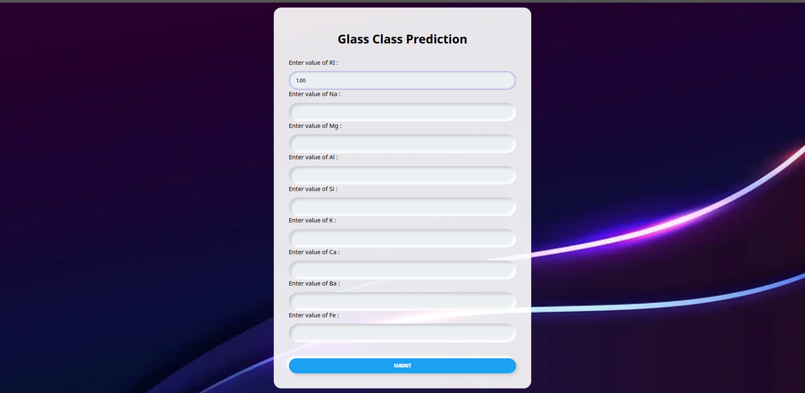
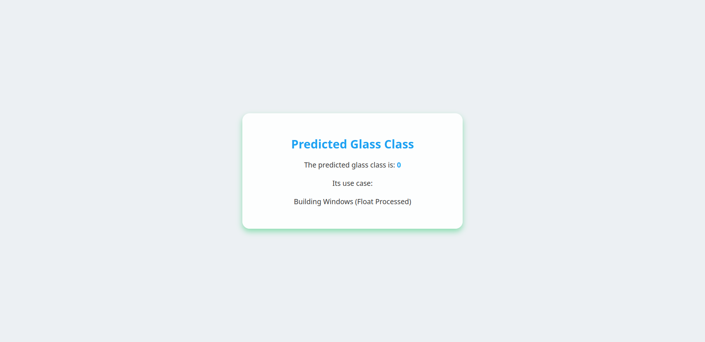

# Glass Type Prediction

This repository contains a machine learning project for predicting the type of glass based on its chemical composition. The project uses various machine learning algorithms to classify glass into different categories.
After identifing the optimal model this project finally uses the RNN model with the accuracy of 0.923

## Project Structure


- **templates/**: Contains HTML templates for the web application.
- **.gitignore**: Specifies files and directories to be ignored by Git.
- **TestingWithAlgorithms.ipynb**: Jupyter notebook for testing various machine learning algorithms.
- **app.py**: Flask web application for predicting glass types.
- **glass.csv**: Dataset used for training and testing the model.
- **requirements.txt**: Lists the dependencies required for the project.
- **rnn_model.keras**: Saved Keras model for glass type prediction.

## Installation

1. Clone the repository:
   ```bash
   git clone https://github.com/saliniyan/glass_type_prediction.git
   cd glass_type_prediction
   ```
   
Create a virtual environment and activate it:
```bash
python3 -m venv venv
source venv/bin/activate
```

Install the required dependencies:
```bash
pip install -r requirements.txt
```

Usage
Run the Flask application:
```bash

python app.py
```

Open your web browser and go to http://127.0.0.1:5000/ to access the application.
Upload the glass dataset and get predictions for the glass type.

## Algorithms Used
The project explores various machine learning algorithms to find the best model for glass type prediction. Details and performance of these algorithms are documented in the TestingWithAlgorithms.ipynb notebook.

## Dataset
The dataset (glass.csv) contains chemical composition data of glass samples. The target variable is the type of glass, which is classified into the following categories:
Building Windows (Float Processed)
Building Windows (Non-Float Processed)
Vehicle Windows (Float Processed)
Vehicle Windows (Non-Float Processed)
Containers
Tableware
Headlamps

## Screenshots

### Login Page


### Home page


### Booking Page



